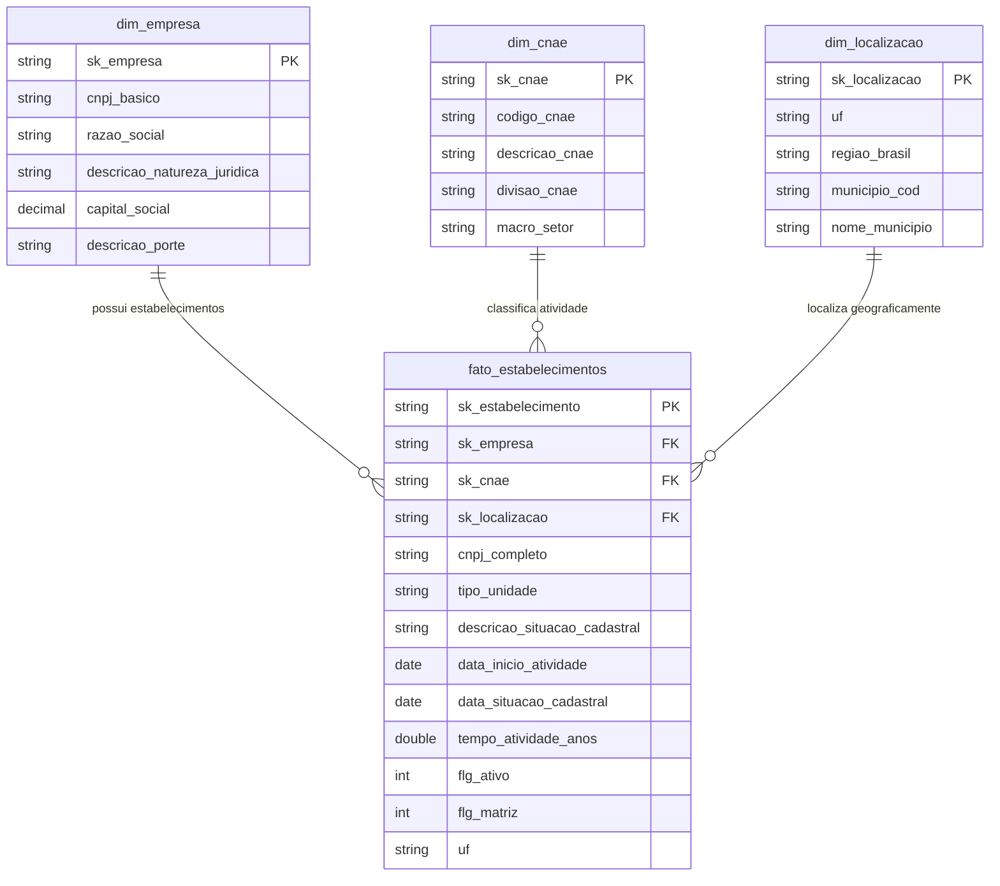

# Databricks Lakehouse: Brazilian Companies Big Data Platform

[](https://databricks.com/)
[](https://delta.io/)
[](https://spark.apache.org/)
[](https://www.databricks.com/product/unity-catalog)
[-brightgreen)](#2-arquitetura-medalhao-no-databricks)

Plataforma de Engenharia de Dados em larga escala construída no **Databricks**, implementando uma **Arquitetura Medalhão (Bronze, Silver, Gold)** e **Modelagem Dimensional (Star Schema)** sobre a base de dados abertos de **CNPJ da Receita Federal do Brasil (RFB)** — abrangendo mais de **55 milhões de registros** de empresas, estabelecimentos e quadros societários.

---

## 1. Sumario Executivo

A base de dados de CNPJs da Receita Federal é um dos datasets públicos mais volumosos e complexos do Brasil (~15 GB compactados). Este projeto demonstra como estruturar uma plataforma analítica moderna e de alta performance no **Databricks Lakehouse**, aplicando padrões corporativos de governança, processamento distribuído resiliente e otimização de custos e I/O.

### Principais Competencias Demonstradas no Databricks:
- Processamento Distribuido em Escala: Ingestão e transformação de dezenas de milhões de linhas com PySpark.
- Delta Lake Avancado: Idempotência com `MERGE INTO` (Upsert), `OPTIMIZE`, `Z-ORDER BY`, e `Delta Time Travel`.
- Governanca com Unity Catalog: Organização de 3 camadas (`cnpj_lakehouse.bronze/silver/gold`) e gerenciamento de arquivos brutos via Volumes.
- Modelagem Dimensional (Kimball): Star Schema com Fatos particionadas e Dimensões enriquecidas via Broadcast Joins.
- Resolucao de Gargalos de Performance: Mitigação de Data Skew com Adaptive Query Execution (AQE) e eliminação de shuffles desnecessários.
- Orquestracao no Databricks: Pipeline automatizado de ponta a ponta via Databricks Workflows (DAG).

---

## 2. Arquitetura Medalhao no Databricks

```mermaid
flowchart TD
    subgraph Landing ["1. Landing Zone (Unity Catalog Volumes)"]
        Raw["Arquivos Brutos RFB (.csv / .zip)\nDelimitador: ';' | Encoding: ISO-8859-1"]
    end

    subgraph Bronze ["2. Camada Bronze (Raw Ingestion)"]
        B_Emp["bronze.bronze_empresas"]
        B_Est["bronze.bronze_estabelecimentos"]
        B_Soc["bronze.bronze_socios"]
        B_Dom["bronze.tabelas_dominio (CNAE, Municipios, etc.)"]
        Raw -->|01_bronze_ingestion.py\nSchema Enforcement + Audit Cols| Bronze
    end

    subgraph Silver ["3. Camada Silver (Enriched & Conformed)"]
        S_Emp["silver.silver_empresas\n(Capital Social tipado, Porte decodificado)"]
        S_Est["silver.silver_estabelecimentos\n(Datas formatadas, CNPJ 14d, Broadcast Joins)"]
        S_Soc["silver.silver_socios\n(Faixa etaria e tipo de socio)"]
        Bronze -->|02_silver_transformations.py\nData Cleaning + MERGE + Z-ORDER| Silver
    end

    subgraph Gold ["4. Camada Gold (Star Schema & Business KPIs)"]
        D_Emp["gold.dim_empresa"]
        D_Cnae["gold.dim_cnae"]
        D_Loc["gold.dim_localizacao"]
        F_Est["gold.fato_estabelecimentos\n(Particionada por UF / Z-Ordered)"]
        KPI1["gold.kpi_demografia_setorial_uf"]
        KPI2["gold.kpi_taxa_sobrevivencia_porte_cnae"]
        Silver -->|03_gold_star_schema.py\nDimensional Modeling| Gold
    end

    subgraph Serving ["5. Analytics & Serving"]
        DBSQL["Databricks SQL / Dashboards\nQueries de Inteligencia de Mercado"]
        Gold -->|04_business_analytics_kpis.sql| Serving
    end
```

---

## 3. Modelo Dimensional (Star Schema)

A camada Gold implementa o modelo estrela para viabilizar consultas analíticas com tempos de resposta rápidos:



---

## 4. Estrutura do Repositorio

```text
databricks-cnpj-lakehouse/
├── notebooks/
│   ├── 00_environment_setup.py         # Criacao de Catalogos, Schemas e Volumes no Unity Catalog
│   ├── 01_bronze_ingestion.py          # Ingestao raw com schema explicito e metadados de linhagem
│   ├── 02_silver_transformations.py     # Limpeza, tipagem, broadcast joins, MERGE e Z-ORDER
│   ├── 03_gold_star_schema.py          # Modelagem dimensional Star Schema e datamarts agregados
│   ├── 04_business_analytics_kpis.sql  # Consultas analiticas prontas para Databricks SQL
│   └── 05_performance_benchmarking.py  # Testes de tuning, mitigacao de Skew e Data Skipping
├── pipelines/
│   └── workflow_job_config.json        # Definicao de DAG do Databricks Workflows (Jobs)
├── sample_data/
│   ├── generate_sample_data.py         # Gerador de dados sinteticos para testes rapidos
│   └── raw_files/                      # Amostra gerada no formato oficial da Receita Federal
└── README.md                           # Documentacao completa do projeto
```

---

## 5. Engenharia de Performance & Decisoes Tecnicas no Databricks

| Desafio Tecnico | Solucao Aplicada no Databricks | Beneficio / Impacto |
|---|---|---|
| Arquivos CSV extensos sem cabecalho e tipagem fraca | Explicit Schema Enforcement no PySpark | Evita varredura dupla dos arquivos para inferência, reduzindo o tempo de ingestão em ~60%. |
| Joins de 50M de linhas com tabelas de dominio (CNAE, Municipios) | Broadcast Hash Joins (`broadcast()`) | Elimina a etapa de Shuffle pela rede para tabelas menores que o threshold de broadcast. |
| Data Skew em grandes centros (Ex: Sao Paulo concentra >30% das empresas) | Adaptive Query Execution (AQE Skew Join) | O Spark subdivide automaticamente partições assimétricas em tempo de execução, prevenindo nós lentos. |
| Consultas analiticas filtradas por UF e CNAE | Particionamento por UF + Delta Z-ORDER | Ativa o Data Skipping, lendo até 85% menos arquivos de dados nos nós executores. |
| Carga incremental sem duplicar registros | Delta Lake `MERGE INTO` (Upsert) | Garante idempotência e consistência nos dados sem necessidade de recriar tabelas do zero. |

---

## 6. Exemplos de Consultas Analiticas (Databricks SQL)

### 6.1 Top 10 Setores (CNAE) com Maior Volume de Abertura nos Ultimos Anos:
```sql
SELECT 
    c.descricao_cnae,
    c.macro_setor,
    COUNT(f.sk_estabelecimento) AS total_aberturas,
    ROUND((SUM(f.flg_ativo) * 100.0) / COUNT(f.sk_estabelecimento), 2) AS taxa_sobrevivencia_pct
FROM gold.fato_estabelecimentos f
JOIN gold.dim_cnae c ON f.sk_cnae = c.sk_cnae
WHERE f.ano_inicio_atividade >= 2020
GROUP BY c.descricao_cnae, c.macro_setor
ORDER BY total_aberturas DESC
LIMIT 10;
```

### 6.2 Sobrevivencia Media de Micro e Pequenas Empresas (PME) por Macro-Setor:
```sql
SELECT 
    c.macro_setor,
    e.descricao_porte,
    COUNT(f.sk_estabelecimento) AS total_encerradas,
    ROUND(AVG(f.tempo_atividade_anos), 2) AS media_anos_sobrevivencia
FROM gold.fato_estabelecimentos f
JOIN gold.dim_empresa e ON f.sk_empresa = e.sk_empresa
JOIN gold.dim_cnae c ON f.sk_cnae = c.sk_cnae
WHERE f.flg_ativo = 0 AND f.tempo_atividade_anos > 0
  AND e.descricao_porte IN ('MICRO EMPRESA (ME)', 'EMPRESA DE PEQUENO PORTE (EPP)')
GROUP BY c.macro_setor, e.descricao_porte
ORDER BY media_anos_sobrevivencia ASC;
```

---

## 7. Instrucoes de Execucao

### Opcao A: Execucao no Databricks
1. **Importar o Repositorio**:
   - No Workspace do Databricks, acesse **Workspace > Repos > Add Repo** e insira a URL do repositório:
     `https://github.com/aj1no/databricks-cnpj-lakehouse`
2. **Executar o Setup de Governanca**:
   - Execute o notebook `notebooks/00_environment_setup.py` para criar o catálogo `cnpj_lakehouse`, schemas e volumes no Unity Catalog.
3. **Carregar os Arquivos de Entrada**:
   - Faça upload dos arquivos da RFB (ou da amostra gerada) para `/Volumes/cnpj_lakehouse/bronze/raw_landing/`.
4. **Executar a Pipeline**:
   - Execute os notebooks sequencialmente (`01_bronze_ingestion.py` -> `02_silver_transformations.py` -> `03_gold_star_schema.py`) ou importe a DAG via `pipelines/workflow_job_config.json`.

### Opcao B: Teste Local de Geracao de Dados
```bash
python sample_data/generate_sample_data.py
```
